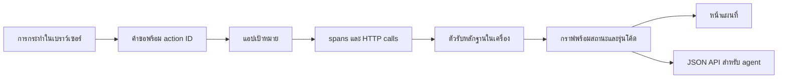

# แผนพัฒนา FlowAtlas MVP

## เป้าหมาย

พิสูจน์ว่า FlowAtlas ช่วยให้นักพัฒนาใหม่และผู้แก้ incident ตามจากการกระทำหนึ่งครั้งในเว็บไปถึงคำขอ API การรันจริง โค้ดที่เกี่ยวข้อง และบริการภายนอกได้เร็วขึ้น โดยไม่แสดงการคาดเดาเป็นข้อเท็จจริง

รุ่นแรกจะรองรับเว็บแอป Node.js หนึ่งระบบและการกระทำ 2–3 แบบ ก่อนขยายภาษา เฟรมเวิร์ก หรือบริการอื่น

## สถานะปัจจุบัน

มีแอปตัวอย่างสามการกระทำ แผนที่หลักฐาน JSON API และชุดทดสอบแล้ว แต่ทั้งแอปและตัวเก็บหลักฐานอยู่ในโครงการเดียวกัน จุด instrumentation เขียนเฉพาะสำหรับตัวอย่าง ข้อมูลเก็บในหน่วยความจำ จึงยังพิสูจน์ไม่ได้ว่าใช้กับแอปอิสระได้

เริ่มระยะ 1 แล้วด้วยตัวตรวจสัญญาข้อมูลที่ตรวจชนิดหลักฐาน correlation ID รุ่นไฟล์ต้นทาง และช่องว่างของ trace พร้อมกรณีทดสอบที่ป้องกันการติดป้าย `observed` ให้ข้อมูลจากเวลาใกล้กันหรือ coverage gap ตัวตรวจนี้ยืนยันความสอดคล้องของข้อมูลที่ตัวเก็บส่งมา แต่ยังไม่ได้พิสูจน์ความแท้ของเหตุการณ์จากแอปอิสระ งานนั้นเป็นเกณฑ์ของระยะ 2

## โครงสร้างเป้าหมาย

Playwright ใช้บันทึกการกระทำและเครือข่ายฝั่งเบราว์เซอร์ ส่วน OpenTelemetry ใช้ trace context และ spans ข้ามคำขอของเซิร์ฟเวอร์ การเชื่อมจาก action ไปยังคำขอจะถือว่า `observed` เฉพาะเมื่อมีรหัส correlation ที่ส่งต่อจริง การอยู่ใกล้กันในเวลาเพียงอย่างเดียวให้ได้มากสุดแค่ `inferred`

## สัญญาข้อมูลหลักฐาน

แต่ละการรันต้องมี `actionId`, เวลา, ผลลัพธ์, รหัส trace/span เมื่อมี, commit และ digest ของไฟล์โค้ด แต่ละ node ระบุชนิดและตัวตน แต่ละ edge มีสถานะหนึ่งใน `observed`, `inferred`, `unknown` พร้อมรายการ evidence ID ที่เปิดดูได้

- `observed`: มีเหตุการณ์รันจริงที่เชื่อมปลายทั้งสอง เช่น correlation ID ในคำขอ หรือ parent/child span ใน trace เดียวกัน
- `inferred`: จับคู่จาก route, import, source map หรือข้อมูลโค้ด โดยระบุวิธีและไฟล์ต้นทาง
- `unknown`: ไม่มีหลักฐานเพียงพอ ต้องบอกว่าขาดข้อมูลช่วงใด

ห้ามเลื่อน edge เป็น `observed` จากเวลา ชื่อ path หรือคำอธิบายที่ AI สร้างอย่างเดียว หาก source file เปลี่ยนหลัง capture ต้องแสดงว่าอ้างอิงคนละ snapshot

## ลำดับงาน

| ระยะ | งาน | เกณฑ์ผ่าน |
| --- | --- | --- |
| 1. สัญญาหลักฐาน | แยก schema และตัวตรวจข้อมูลออกจากแอปตัวอย่าง เพิ่ม fixture ของเส้นที่รู้คำตอบและกรณี trace ขาด | ทุก observed edge มีหลักฐานรันที่ตรวจได้ และกรณีข้อมูลขาดไม่กลายเป็น observed |
| 2. แอปอิสระ | ทำตัวรับเหตุการณ์ในเครื่องและ adapter สำหรับเว็บแอป Node.js ที่อยู่นอกตัว FlowAtlas ส่ง action ID และ trace context ผ่าน HTTP | รัน 2–3 actions ในแอปอิสระแล้วได้กราฟถูกต้อง แม้บริการปลายทางไม่ได้ติดตั้งตัวเก็บ trace |
| 3. โค้ดและรุ่น | จับคู่ span/route กับไฟล์และ symbol เท่าที่พิสูจน์ได้ เก็บ commit กับ file hash; ความสัมพันธ์จากการอ่านโค้ดต้องเป็น inferred | เปิดหลักฐานและไฟล์ตรงกับรุ่นที่ capture ได้; เมื่อไฟล์เปลี่ยนต้องแจ้ง mismatch |
| 4. ใช้งานจริง | เก็บผลลงพื้นที่ถาวรในเครื่อง เพิ่มตัวกรองและคำอธิบายบนแผนที่ พร้อม JSON query ที่มี schema คงที่ | ปิดแล้วเปิดใหม่ยังเรียก run เดิมได้; query ตอบพร้อม evidence IDs และ uncertainty |
| 5. พิสูจน์คุณค่า | ทำโจทย์เข้าใจโค้ดและวินิจฉัยเหตุที่มีคำตอบอ้างอิง เทียบการทำงานกับและไม่มี FlowAtlas | รายงานความถูกต้อง เวลา และการชี้สาเหตุผิด พร้อมเคสที่เครื่องมือช่วยไม่ได้ |

ทำระยะ 1 และ 2 ก่อนเพิ่มคำอธิบายจาก AI หรือรองรับหลายภาษา เพราะสองระยะนี้กำหนดว่าข้อมูลที่แสดงเชื่อถือได้หรือไม่

## การวัดผล

- **ความถูกต้องของกราฟ:** ตรวจ node และ edge กับ trace และ source snapshot ที่รู้คำตอบล่วงหน้า นับ false observed แยกจาก edge ที่หาย
- **งานเข้าใจระบบ:** ให้ผู้ทดสอบบอกว่า action ผ่าน API ฟังก์ชัน และบริการใด วัดเวลาและคำตอบถูกต้อง
- **งาน incident:** ใช้กรณีสำเร็จ สต็อกหมด และบริการปลายทางล้ม วัดเวลาหาสาเหตุและจำนวนข้อสรุปผิด
- **ต้นทุนการใช้:** วัดเวลาเพิ่ม instrumentation ปริมาณข้อมูลที่เก็บ และ overhead ของคำขอ

ผลทดลองต้องแยกจากเป้าหมายที่ตั้งไว้ ไม่อ้างว่าช่วยได้เร็วขึ้นจนกว่าจะทดสอบกับผู้ใช้

## ขอบเขตความปลอดภัยของรุ่นแรก

ตัวรับหลักฐานฟังเฉพาะเครื่อง เก็บ metadata ขั้นต่ำ ไม่เก็บ request body, token หรือ cookie โดยปริยาย จำกัดจำนวนและอายุ run ที่เก็บ และให้ผู้ใช้เลือกก่อนส่งออกข้อมูล trace เพราะอาจมี URL หรือชื่อบริการภายใน

## สิ่งที่ต้องตัดสินใจเมื่อถึงระยะ 2

1. เลือกเว็บแอป Node.js อิสระที่จะใช้เป็นกรณีทดลอง ถ้ามีแอปของผู้ใช้ให้ใช้แอปนั้นหลังตรวจโครงสร้างและสิทธิ์ มิฉะนั้นสร้าง fixture แยกในโครงการ
2. เลือกตำแหน่งติดตั้ง browser action adapter เพื่อให้ action ID ส่งต่อจริง โดยไม่อ้างความสัมพันธ์จากเวลาอย่างเดียว
3. เลือกสัญญาอนุญาตโอเพนซอร์สก่อนเผยแพร่ repository สาธารณะ

## เอกสารเทคนิคที่ใช้อ้างอิง

- [OpenTelemetry JavaScript propagation](https://opentelemetry.io/docs/languages/js/propagation/)
- [OpenTelemetry Propagators API](https://opentelemetry.io/docs/specs/otel/context/api-propagators/)
- [Playwright tracing](https://playwright.dev/docs/api/class-tracing)
- [Playwright Trace Viewer](https://playwright.dev/docs/trace-viewer)
