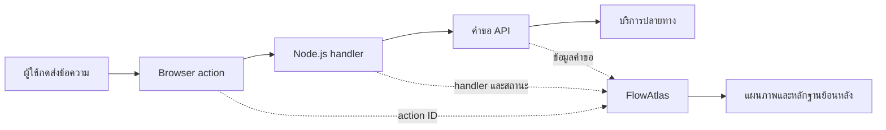

# FlowAtlas

FlowAtlas ช่วยให้นักพัฒนาเห็นว่า **การกระทำหนึ่งครั้งบนเว็บเดินทางผ่านโค้ดและบริการใดบ้าง** เช่น จากการกดปุ่ม ไปยัง handler, API และบริการที่แอปเรียกใช้ ผลลัพธ์เป็นแผนภาพพร้อมหลักฐานที่เปิดดูย้อนหลังได้

เหมาะสำหรับทำความเข้าใจโค้ดที่เพิ่งเข้ามาดู หรือตามหาสาเหตุของปัญหาที่ผู้ใช้พบ ปัจจุบันเป็นเครื่องมือรุ่นทดลองสำหรับแอป Node.js ที่เชื่อม adapter แล้ว ตัวติดตามไม่ได้ค้นพบการทำงานภายในของแอปโดยอัตโนมัติ

## นึกภาพตามได้อย่างไร

สมมติผู้ใช้กด **ส่งข้อความ** แล้วได้รับข้อผิดพลาด ปกตินักพัฒนาอาจต้องไล่จากหน้าเว็บไปหา handler และคำขอที่ออกไปเอง FlowAtlas รวมเหตุการณ์ที่เชื่อมไว้ให้ดูเป็นเส้นทางเดียว:



ตัวอย่างเช่น แผนภาพอาจช่วยชี้ว่าการกดปุ่มมาถึง handler แล้ว แต่คำขอไปบริการปลายทางล้มเหลว หรือยังไม่มีข้อมูลจากบางช่วง ทำให้รู้ว่าจะเริ่มตรวจตรงไหนก่อน ทั้งนี้ FlowAtlas แสดงเฉพาะเหตุการณ์ที่แอปเชื่อมไว้ และไม่ได้วิเคราะห์หาสาเหตุให้อัตโนมัติ

## ช่วยใคร และช่วยอย่างไร

- **นักพัฒนาที่เพิ่งรับช่วงโปรเจกต์** — เห็นว่า action สำคัญเรียกโค้ดและบริการใดบ้าง โดยไม่ต้องเริ่มไล่ค้นจากทั้ง codebase
- **คนแก้ปัญหาในระบบ** — ตามจากอาการที่ผู้ใช้เห็นไปยัง handler หรือคำขอที่มีหลักฐานผิดพลาด และแยกส่วนที่ยังไม่มีข้อมูลได้
- **ทีมที่ดูแลการเชื่อมต่อหลายบริการ** — ตรวจเส้นทางของ action ที่เลือกไว้และย้อนดูหลักฐานภายหลังได้

ประโยชน์จะครอบคลุมเท่าจุดที่ติดตั้ง adapter และ instrumentation เท่านั้น หากบริการปลายทางไม่ได้ส่งรายละเอียดภายในเข้ามา แผนภาพจะแสดงได้เพียงการเรียกไปยังบริการนั้น ไม่สามารถบอกสิ่งที่เกิดขึ้นข้างในได้

## สิ่งที่ทำได้

- เชื่อม browser action กับ handler และคำขอ HTTP ที่แอปบันทึกไว้
- แสดงลำดับการทำงานและหลักฐานของ action รวมถึงกรณีสำเร็จหรือผิดพลาด
- ดูประวัติ action และเปิดดูไฟล์ต้นทางที่ลงทะเบียนไว้
- เรียกผ่าน CLI และเปิดหน้า viewer ในเครื่อง

FlowAtlas เก็บข้อมูล action ไว้ในเครื่องตาม workspace ที่เลือก การเชื่อมแอปต้องเพิ่ม instrumentation เอง ขอบเขตหลักฐานขึ้นกับจุดที่แอปส่งข้อมูลเข้ามา กราฟจึงอาจแสดงส่วนที่ยังไม่ถูกติดตามว่าไม่ทราบ

## สิ่งที่ต้องมี

- Node.js 20.6 ขึ้นไป
- npm
- Windows, macOS หรือ Linux ที่รัน Node.js ได้

## ติดตั้งและลองใช้งาน

เปิด Terminal แล้วเข้าโฟลเดอร์โปรเจกต์:

```sh
npm ci --ignore-scripts --no-audit --no-fund
```

สร้างแอปตัวอย่างและเริ่มตรวจความพร้อม:

```sh
node scripts/cli.mjs demo
node scripts/cli.mjs doctor
```

เริ่มแอปตัวอย่างพร้อมหน้า FlowAtlas:

```sh
node scripts/cli.mjs inspect
```

เปิด URL ของแอปที่ CLI แสดง แล้วกดปุ่มตัวอย่าง เช่น ดูหรือส่งข้อความ จากนั้นเปิดลิงก์ FlowAtlas เพื่อดูแผนภาพ หากระบบถาม pairing code ให้นำรหัสจาก Terminal ที่กำลังทำงานมาใส่ เมื่อเลิกใช้งาน พิมพ์ `stop` ใน Terminal แล้วกด Enter

ข้อมูลตัวอย่างและประวัติจะถูกเก็บในโฟลเดอร์โปรเจกต์ หากต้องการใช้ workspace แยก ให้สร้างโฟลเดอร์ก่อน แล้วระบุ `--workspace PATH` ในแต่ละคำสั่ง:

```sh
mkdir flowatlas-data
node scripts/cli.mjs --workspace ./flowatlas-data demo
node scripts/cli.mjs --workspace ./flowatlas-data doctor
node scripts/cli.mjs --workspace ./flowatlas-data inspect
```

## ใช้กับแอปของคุณ

FlowAtlas ยังเชื่อมแอปที่มีอยู่ให้โดยอัตโนมัติไม่ได้ ขั้นตอนหลักคือ:

1. ลงทะเบียนแอปและไฟล์ต้นทางที่อนุญาตให้ viewer อ่าน
2. เพิ่ม adapter และ instrumentation ในจุดของ browser action และ handler ที่ต้องการติดตาม
3. เริ่ม collector ด้วย `inspect --project ID` แล้วเปิดแอปและทำ action นั้น
4. เปิดลิงก์ที่แสดงเพื่อดูกราฟและหลักฐาน

อ่าน [คู่มือเชื่อมแอป Node.js](docs/node-adapter.md) สำหรับตัวอย่างและรูปแบบการตั้งค่า คำสั่งทั้งหมดดูได้ด้วย:

```sh
node scripts/cli.mjs --help
```

## ความเป็นส่วนตัวและขอบเขต

- ต้องเพิ่ม instrumentation ในแอปเอง FlowAtlas จะแสดงเฉพาะเหตุการณ์ที่เชื่อมไว้
- Adapter ส่ง metadata ที่กำหนด เช่น action, handler, ปลายทาง และสถานะ ไม่ส่ง request body, response body, cookie หรือ token
- pairing code ใช้ควบคุมการเข้าถึง session ของ viewer อย่าแชร์รหัสนี้
- `doctor` ตรวจเงื่อนไขเบื้องต้น แต่ผลผ่านไม่ได้ยืนยันว่าแอปจริงเชื่อมและทำงานครบ
- โปรเจกต์ยังอยู่ระหว่างพัฒนาและยังไม่ผ่านการทดลองกับแอปงานจริงอย่างครบถ้วน

## เอกสารเพิ่มเติม

- [ติดตั้งและเรียกใช้](docs/install.md)
- [เชื่อมแอป Node.js](docs/node-adapter.md)
- [ควบคุมการเข้าถึง session](docs/session-access.md)
- [การจัดเก็บและกู้คืนข้อมูล](docs/storage.md)
- [แผนพัฒนาและสถานะ](PLAN.md)
